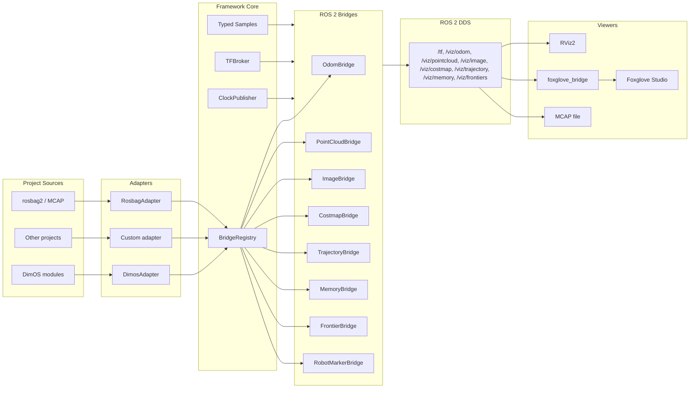

# ros2_visualization

A **project-agnostic ROS 2 visualization framework** for robotics debugging.

Records and visualises: odometry, trajectories, frontiers, spatial memory,
relocalization events, LiDAR point clouds, images, and occupancy grids —
all time-aligned and interactively inspectable via **Foxglove Studio** or **RViz2**.

---

## Architecture



**Layer rule:** `source → adapter → core → bridge → rclpy`.  Nothing flows backwards.

---

## Quick Start

### 1. Start DimOS

```bash
dimos --simulation run unitree-go2-vln-local --daemon
```

### 2. Launch the visualization bridge

```bash
# Foxglove Studio (open ws://localhost:8765 in Foxglove):
python -m dimos.ros2_visualization.cli.run --foxglove

# Foxglove + RViz2 + record to MCAP:
python -m dimos.ros2_visualization.cli.run --foxglove --rviz --record --out /tmp/session.mcap

# Check imports without ROS 2:
python -m dimos.ros2_visualization.cli.run --dry-run
```

### 3. Open Foxglove Studio

1. Connect to `ws://localhost:8765`
2. **File → Import layout** → select `panels/foxglove/dimos_default.json`
3. See live: 3D map, camera image, memory markers, trajectory arrows, frontier spheres

### 4. Replay a recording

```bash
ros2 bag play /tmp/session.mcap --clock
python -m dimos.ros2_visualization.cli.run --foxglove
```

---

## Interactive Inspection

| Click target | How | Payload shown |
|---|---|---|
| **Robot body** | `InteractiveMarker` on `base_link` → hover tooltip | L/W/H, mesh, sensors |
| **Trajectory waypoint** | MarkerArray arrow → `/viz/trajectory/metadata` sidecar | critic, cost, speed, (x,y,yaw) |
| **Memory sphere** | MarkerArray sphere → `/viz/memory/metadata` sidecar | pose, tags, similarity |
| **Frontier sphere** | MarkerArray sphere → `/viz/frontiers/metadata` sidecar | score breakdown, VLM confidence |

Open the **RawMessages** panel in Foxglove and point it at `/viz/trajectory/metadata`,
`/viz/memory/metadata`, or `/viz/frontiers/metadata` to see per-element JSON.

---

## Add a new data type in 10 lines

### Step 1 — Add a dataclass to `core/schema.py`

```python
@dataclass
class DetectionSample:
    label: str
    confidence: float
    x: float; y: float; z: float
    stamp_ns: int
    frame: str = "odom"
```

### Step 2 — Create `bridges/detection_bridge.py`

```python
from dimos.ros2_visualization.core.bridge_base import Bridge
from dimos.ros2_visualization.core.schema import DetectionSample

class DetectionBridge(Bridge):
    sample_type = DetectionSample
    name = "detection"

    def start(self, node):
        super().start(node)
        from visualization_msgs.msg import Marker, MarkerArray
        from dimos.ros2_visualization.core.qos import QoSProfile, build
        self._pub = node.create_publisher(MarkerArray, "/viz/detections", build(QoSProfile.RELIABLE))
        self._Marker = Marker; self._MarkerArray = MarkerArray

    def on_sample(self, sample: DetectionSample):
        self._check_started()
        # ... build MarkerArray from sample, publish
```

### Step 3 — Register in your adapter

```python
registry.register(DetectionBridge())

# In your adapter's bind():
my_detection_stream.subscribe(lambda msg: registry.publish(
    DetectionSample(label=msg.label, confidence=msg.score, ...)
))
```

That's it. No changes to `core/`, no changes to other bridges.

---

## Package layout

```
ros2_visualization/
  core/
    schema.py        — Typed dataclasses: OdomSample, TrajSample, MemoryRecord, ...
    bridge_base.py   — Bridge ABC (start/on_sample/stop)
    registry.py      — BridgeRegistry (owns single rclpy Node)
    clock.py         — ClockPublisher (/clock at 100 Hz)
    tf_broker.py     — TFBroker (map→odom→base_link + static sensor transforms)
    qos.py           — Pre-tuned QoS profiles
    frames.py        — TF frame name constants
    metadata.py      — JSON metadata sidecar publisher
  bridges/
    odom_bridge.py          → /viz/odom (nav_msgs/Odometry) + TF
    path_bridge.py          → /viz/path (nav_msgs/Path, grow-only trail)
    image_bridge.py         → /viz/image/compressed (rate-limited JPEG)
    pointcloud_bridge.py    → /viz/pointcloud (sensor_msgs/PointCloud2)
    costmap_bridge.py       → /viz/costmap (nav_msgs/OccupancyGrid)
    trajectory_bridge.py    → /viz/trajectory (MarkerArray) + metadata sidecar
    memory_bridge.py        → /viz/memory/markers + thumbnail + query events
    frontier_bridge.py      → /viz/frontiers (MarkerArray) + metadata sidecar
    robot_marker_bridge.py  → /robot_marker_server (InteractiveMarker)
  adapters/
    base.py              — Adapter ABC (zero ROS imports — pure Python)
    dimos/
      streams.py         — DimosAdapter: wires DimOS Out[T] streams
      navdp_source.py    — NavDPAdapter: polls NavDP trajectory candidates
      memory_source.py   — MemoryAdapter: polls SpatialMemory entries
  panels/
    foxglove/dimos_default.json  — Foxglove layout: 3D + Image + Memory + Metadata
    rviz/default.rviz            — RViz2 config with all topics
  launch/
    dimos_viz.launch.py  — ROS 2 launch: foxglove_bridge + optional rviz2 + mcap record
  cli/
    run.py               — `python -m dimos.ros2_visualization.cli.run`
  tests/
    test_bridges_contract.py  — Contract tests (mocked rclpy, no ROS daemon needed)
```

---

## Topics published

| Topic | Type | Rate | Notes |
|---|---|---|---|
| `/viz/odom` | `nav_msgs/Odometry` | full | Robot pose + velocity |
| `/viz/path` | `nav_msgs/Path` | full | Accumulated trail (max 2000 poses) |
| `/viz/image/compressed` | `sensor_msgs/CompressedImage` | ≤ 10 Hz | Rate-limited JPEG |
| `/viz/pointcloud` | `sensor_msgs/PointCloud2` | ≤ 5 Hz | Rate-limited LiDAR |
| `/viz/costmap` | `nav_msgs/OccupancyGrid` | full | NavDP costmap |
| `/viz/trajectory` | `visualization_msgs/MarkerArray` | ≤ 10 Hz | NavDP trajectories (all candidates) |
| `/viz/trajectory/metadata` | `std_msgs/String` | same | Per-waypoint JSON |
| `/viz/memory/markers` | `visualization_msgs/MarkerArray` | latched | One sphere per memory entry |
| `/viz/memory/metadata` | `std_msgs/String` | latched | Per-entry JSON |
| `/viz/memory/thumbnail` | `sensor_msgs/CompressedImage` | on query | Latest memory hit image |
| `/viz/memory/query` | `std_msgs/String` | on query | Full VLN query + results JSON |
| `/viz/frontiers` | `visualization_msgs/MarkerArray` | full | Frontier candidates |
| `/viz/frontiers/metadata` | `std_msgs/String` | same | Per-frontier score JSON |
| `/tf` | `tf2_msgs/TFMessage` | full | map→odom→base_link |
| `/tf_static` | `tf2_msgs/TFMessage` | latched | base_link→lidar, base_link→camera |
| `/clock` | `rosgraph_msgs/Clock` | 100 Hz | Wall clock for replay |

---

## Reuse outside DimOS

1. Implement `Adapter` (≈ 150–300 lines), subscribing to your data and calling `registry.publish(SomeSample(...))`.
2. Register your adapter in `cli/run.py` or your own launch file.
3. Reuse all `bridges/`, `panels/`, `launch/` unchanged.

No DimOS dependency is required to use `core/`, `bridges/`, or `panels/`.

---

## Running the contract tests

```bash
# No ROS 2 installation required:
uv run pytest dimos/ros2_visualization/tests/test_bridges_contract.py -v
```
